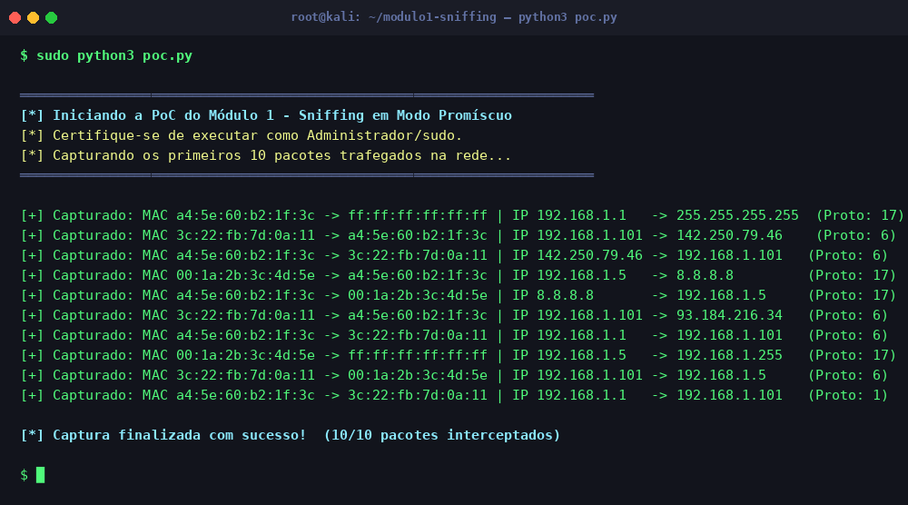

# Módulo 1 — Sniffing e Interceptação (Camada 2 e 3)

## Objetivo

Demonstração prática de captura de pacotes e funcionamento do **modo promíscuo** (promiscuous mode) em interfaces de rede, abordando o comportamento do controlador de interface de rede (NIC) nas camadas 2 e 3 do modelo OSI.

## Conceito Técnico

Em operação normal, uma NIC descarta quadros Ethernet cujo MAC de destino não corresponde ao seu próprio. No **modo promíscuo**, esse filtro é desativado: a interface repassa todos os quadros recebidos para a pilha de rede, permitindo capturar tráfego destinado a outros hosts — base do funcionamento de ferramentas como Wireshark e tcpdump.

## Ferramenta Utilizada

- **Scapy** — Biblioteca Python para manipulação e captura de pacotes de rede.
- Execução requer privilégios de **root/administrador**.

## Estrutura da Demonstração

```
Ferramenta usada → Passo a Passo → Resultado → Explicação Técnica
```

Veja a implementação em [`poc.py`](./poc.py).

## Como Executar

```bash
# Requer privilégios de administrador/root
sudo python3 poc.py
```

## Resultado Esperado

A PoC captura os 10 primeiros pacotes trafegados na rede local, exibindo os endereços MAC (Camada 2) e IP (Camada 3) de origem e destino, além do protocolo utilizado.



> **Análise:** Observe que pacotes destinados a outros hosts (MACs distintos) são interceptados com sucesso, confirmando o funcionamento do modo promíscuo. O protocolo `17` corresponde ao UDP e o `6` ao TCP.
