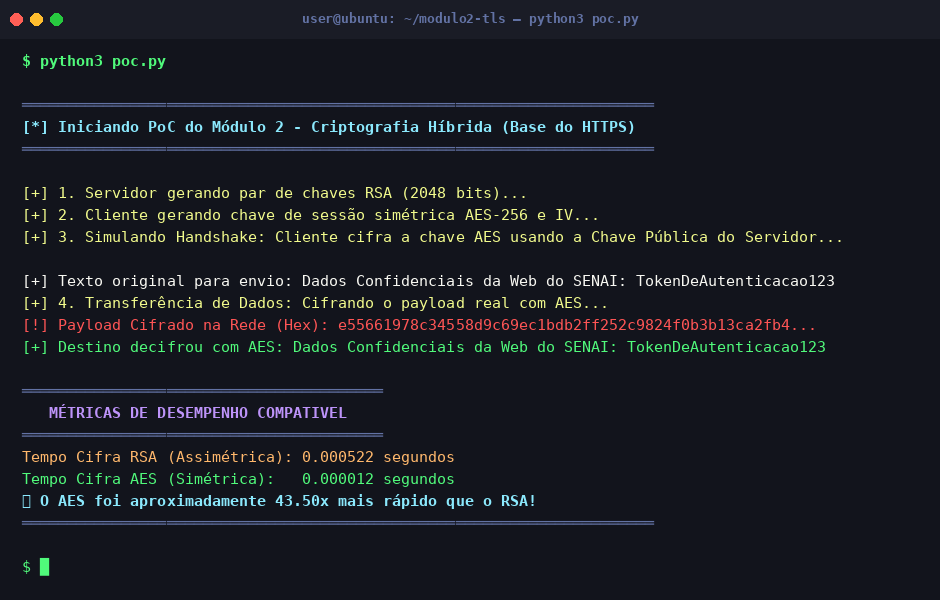

# Módulo 2 — Criptografia e Handshake (A Base do TLS)

## Objetivo

Demonstração prática do conceito de **criptografia híbrida** utilizado pelo HTTPS/TLS: uso de criptografia assimétrica (RSA) para a troca segura da chave de sessão e criptografia simétrica (AES) para a transferência veloz dos dados.

## Conceito Técnico

O TLS não usa RSA para cifrar todo o tráfego pois operações assimétricas são ordens de magnitude mais lentas que as simétricas. A solução é a **criptografia híbrida**:

1. **Fase 1 (Handshake):** O cliente usa a chave pública RSA do servidor para cifrar e transmitir com segurança uma chave de sessão AES gerada aleatoriamente.
2. **Fase 2 (Transferência):** Todo o tráfego de dados real é cifrado/decifrado com a chave AES compartilhada — operação extremamente rápida.

## Ferramenta Utilizada

- **cryptography** (Python) — Biblioteca de primitivas criptográficas de alto nível.
- Algoritmos: `RSA-2048` com padding `OAEP/SHA-256` e `AES-256` no modo `CFB`.

## Estrutura da Demonstração

```
Ferramenta usada → Passo a Passo → Resultado → Explicação Técnica
```

Veja a implementação em [`poc.py`](./poc.py).

## Como Executar

```bash
pip install cryptography
python3 poc.py
```

## Resultado Esperado

A PoC simula as duas fases do TLS, cifra um payload real, exibe o ciphertext hexadecimal e compara o tempo de execução entre RSA e AES.



> **Análise:** O payload `Dados Confidenciais...` é cifrado para uma sequência hexadecimal ilegível e corretamente recuperado no destino. As métricas de desempenho evidenciam por que o AES é usado para os dados: é dezenas de vezes mais rápido que o RSA, justificando a arquitetura híbrida do TLS.
