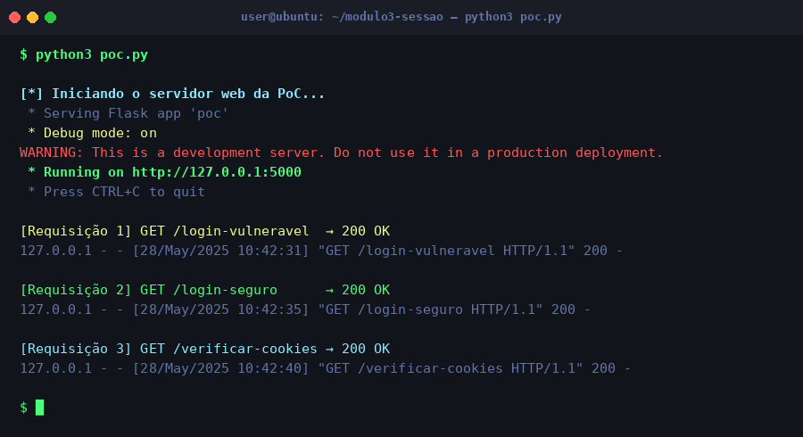
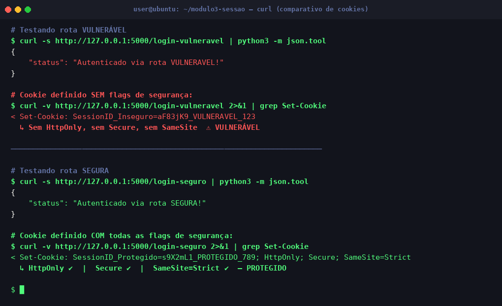

# Módulo 3 — Segurança na Camada de Aplicação (Gestão de Sessão)

## Objetivo

Demonstração prática da **gestão de sessão via cookies** em uma aplicação web Flask, comparando o comportamento de um `SessionID` sem flags de segurança (vulnerável) versus um com as diretivas `HttpOnly`, `Secure` e `SameSite=Strict` (protegido).

## Conceito Técnico

O `SessionID` é um **token de portador**: quem o possui é autenticado como o usuário legítimo. Sem as flags corretas:

- **Sem `HttpOnly`:** Scripts JavaScript podem ler o cookie → risco de **Session Hijacking via XSS**.
- **Sem `Secure`:** O cookie é enviado em HTTP puro → exposto a **sniffers na rede** (como a PoC do Módulo 1).
- **Sem `SameSite`:** O browser envia o cookie em requisições cross-site → risco de **CSRF**.

## Ferramenta Utilizada

- **Flask** (Python) — Micro-framework web para a PoC.
- Teste das rotas via **curl** e inspeção no **Browser DevTools** (aba Application → Storage → Cookies).

## Estrutura da Demonstração

```
Ferramenta usada → Passo a Passo → Resultado → Explicação Técnica
```

Veja a implementação em [`poc.py`](./poc.py).

## Como Executar

```bash
pip install flask
python3 poc.py
# Acesse: http://127.0.0.1:5000
```

## Rotas Disponíveis

| Rota | Comportamento |
|------|--------------|
| `/login-vulneravel` | Define cookie **sem** nenhuma flag de segurança |
| `/login-seguro` | Define cookie **com** `HttpOnly`, `Secure` e `SameSite=Strict` |
| `/verificar-cookies` | Lista os cookies ativos recebidos pelo servidor |

## Resultado Esperado

### Servidor Flask inicializado



### Comparativo de cookies — Vulnerável vs. Seguro



> **Análise:** O cookie inseguro (`SessionID_Inseguro`) não possui nenhuma proteção — pode ser lido por JavaScript e trafegado em HTTP puro. O cookie seguro (`SessionID_Protegido`) carrega as três flags obrigatórias, eliminando os vetores de XSS, sniffing e CSRF.
