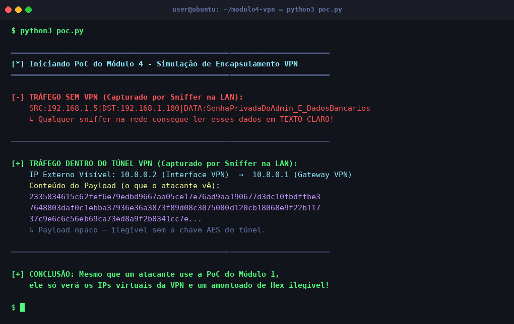

# Módulo 4 — VPN (Virtual Private Network)

## Objetivo

Demonstração prática do conceito de **tunelamento e encapsulamento VPN**: como o tráfego sensível de um usuário, visível em texto claro na rede local, torna-se completamente opaco após ser encapsulado dentro de um túnel criptografado.

## Conceito Técnico

Uma VPN cria um **túnel criptografado** entre o cliente e o gateway. O processo envolve:

1. **Encapsulamento:** O pacote original (com os dados reais e os IPs internos) é tratado como payload e cifrado.
2. **Novo cabeçalho IP:** O payload cifrado é encapsulado com novos cabeçalhos IP (os da interface virtual VPN, ex: `10.8.0.x`).
3. **Transmissão:** Um sniffer na LAN vê apenas os IPs virtuais da VPN e um bloco de bytes cifrados — os dados reais e os IPs originais são completamente ocultos.

## Ferramenta Utilizada

- **cryptography** (Python) — Cifração `AES-256-CFB` para simular o encapsulamento do túnel.
- Referência de implementação real: **WireGuard** (ChaCha20-Poly1305 + Curve25519).

## Estrutura da Demonstração

```
Ferramenta usada → Passo a Passo → Resultado → Explicação Técnica
```

Veja a implementação em [`poc.py`](./poc.py).

## Como Executar

```bash
pip install cryptography
python3 poc.py
```

## Resultado Esperado

A PoC exibe lado a lado o tráfego como um atacante o veria **sem VPN** (texto claro com dados sensíveis) e **com VPN** (apenas IPs virtuais e payload hexadecimal ilegível).



> **Análise:** Sem a VPN, a string `SenhaPrivadaDoAdmin_E_DadosBancarios` é completamente legível por qualquer sniffer (como demonstrado no Módulo 1). Com o túnel ativo, o atacante vê apenas os IPs virtuais `10.8.0.x` e uma sequência hexadecimal opaca — impossível de decifrar sem a chave AES do túnel.

## Evidências

As capturas de tela e logs deste módulo estão disponíveis em [`evidencias/`](./evidencias/).
